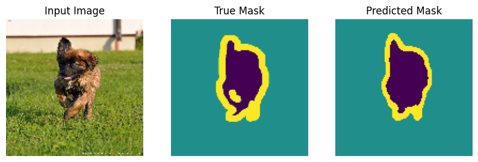

# Pixel-Perfect Semantic Segmentation with U-Net 🖼️

A deep learning model capable of performing **semantic segmentation** on the Oxford-IIIT Pet Dataset. Unlike standard object detection (which uses bounding boxes), this model classifies every single pixel in the image into one of three categories: **Pet, Background, or Border**.


*(Left: Input Image | Center: Ground Truth | Right: Model Prediction)*

## 🚀 Key Features
* **Architecture:** Custom **U-Net** built from scratch using TensorFlow Functional API.
* **Skip Connections:** Implemented to preserve spatial resolution and fine-grained details during upsampling.
* **Precision:** Achieved **~88% pixel-level accuracy** in distinguishing subject boundaries.
* **Optimization:** Utilized **Mixed Precision (float16)** training on T4 GPU for 2x faster convergence.

## 🧠 Technical Deep Dive
The model solves the problem of "Where is the object exactly?" using an Encoder-Decoder structure:
1.  **Encoder (Downsampling):** Captures high-level context (e.g., "This is a dog") using Convolutional blocks and Max Pooling.
2.  **Bottleneck:** Compresses the feature map to understanding the core content.
3.  **Decoder (Upsampling):** Reconstructs the spatial dimensions using **Transposed Convolutions**.
4.  **Skip Connections:** The critical component that concatenates feature maps from the Encoder directly to the Decoder, recovering spatial information lost during downsampling.

## 🛠️ Tech Stack
* **Framework:** TensorFlow / Keras
* **Dataset:** Oxford-IIIT Pet Dataset (Version 4.0.0)
* **Pipeline:** `tf.data` for high-performance caching and prefetching.
* **Hardware:** Trained on NVIDIA T4 GPU (Google Colab).

## 📊 Results
| Class | Visualization Color | Meaning |
| :--- | :--- | :--- |
| **0** | 🟪 Purple | The Pet (Cat/Dog) |
| **1** | 🟦 Teal | Background |
| **2** | 🟨 Yellow | Object Boundary (Border) |

## 💻 How to Run
1. Clone the repository:
   ```bash
   git clone [https://github.com/YOUR_USERNAME/Pixel-Perfect-Segmentation-UNet.git](https://github.com/YOUR_USERNAME/Pixel-Perfect-Segmentation-UNet.git)
